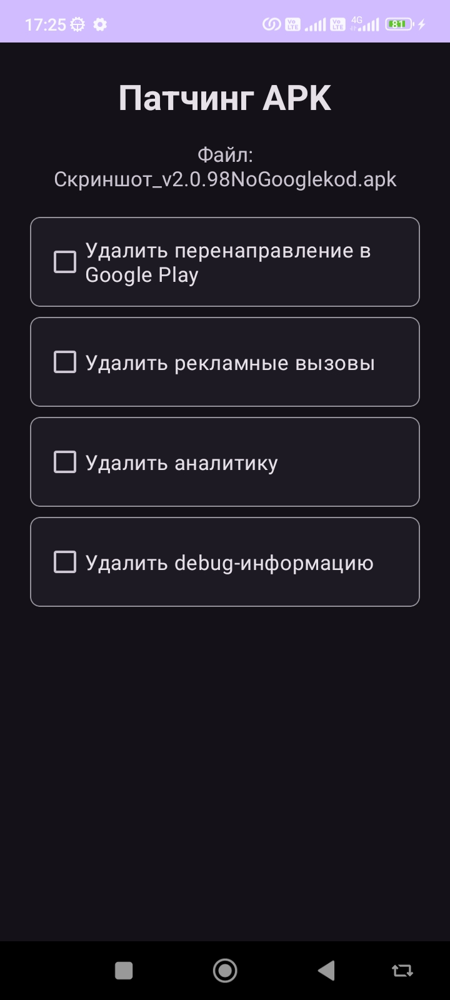
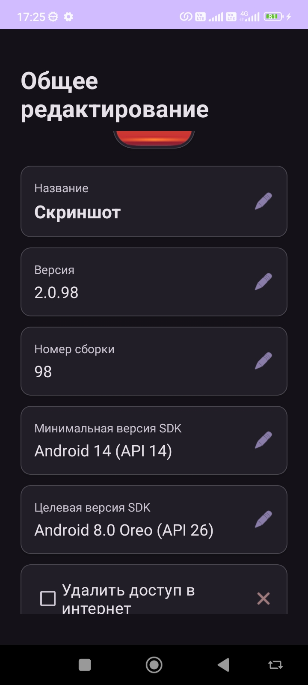
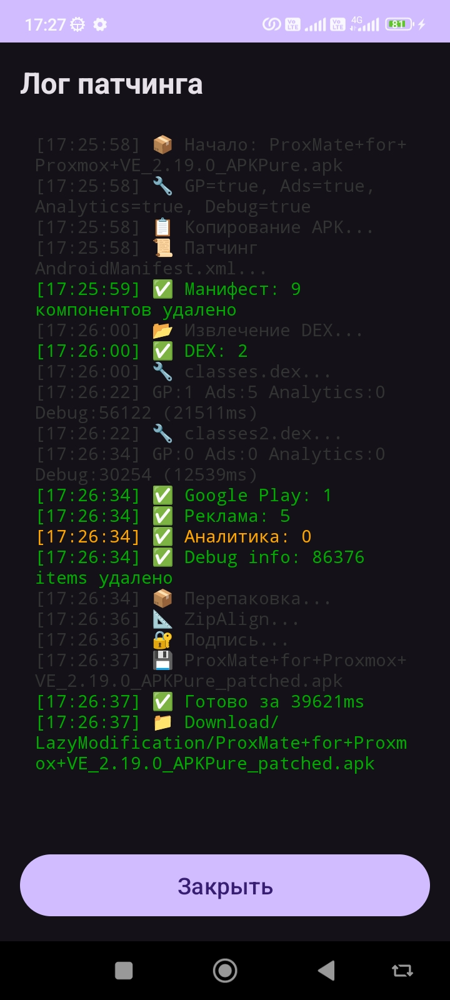

# Lazy Modification

<p align="center">
  
</p>

**Версия: 1.23** · Обновлено: 02.10.2026

**Lazy Modification** — программа для работы с APK, APKS и XAPK файлами, а также патчинга APK.

В основном — для тех, кто не разбирается в модифицировании APK, а свой мод хочется. Здесь всё просто: выбрал файл, поставил галочки — и получил готовое без лишних телодвижений.

## Возможности

* Конвертация APKS
* Извлечение из установленных
* Разделение по архитектурам
* Клонирование
* Общее редактирование
* Изменение интерфейса
* Перевод приложения
* Инспектор APK
* Сравнение APK
* Патчинг
* Создание подписи (PKCS12 / JKS)

## Скриншоты

<p align="center">
  
  
  
  
</p>

## Что нового в 1.23

* **Инструменты**: новая форма на главной — создание собственной подписи (keystore) с пояснениями
* **Создание подписи**: форматы PKCS12 и JKS (совместимо с keytool/apksigner); на устройстве читаются и созданные JKS, и чужие
* **Новый дизайн формы «Патчинг»**: кнопки-переключатели с отметкой ☐/☑, кнопка «Инспектор APK»; если патч обновления не найден — файл не пересобирается
* Устранены вылеты (OOM) на больших APK: патч манифеста, список локалей, инспектор и удаление локалей — потоковая обработка без загрузки таблицы ресурсов
* **Удаление локалей**: поддержка «разреженных» (sparse) таблиц нового aapt2 — удаляются все выбранные языки; добавлен код phi
* Исправлен разбор строковых пулов ресурсов (UTF-8/UTF-16)

## Требования

* Android 5.0 и выше
* Интерфейс: русский / English / български

## Сборка

```bash
./gradlew assembleDebug
```

## Ссылки

* Обсуждение и обновления на 4PDA: [тема программы](https://4pda.to/forum/index.php?showtopic=1123930)
* Скачать APK: [Releases](https://github.com/Garant68/LazyModification/releases)
* Разработчик: **Garant68**
* Имя пакета: `com.example.lazymodification`

---

*Программа предоставляется «как есть». Используйте на свой страх и риск.*
